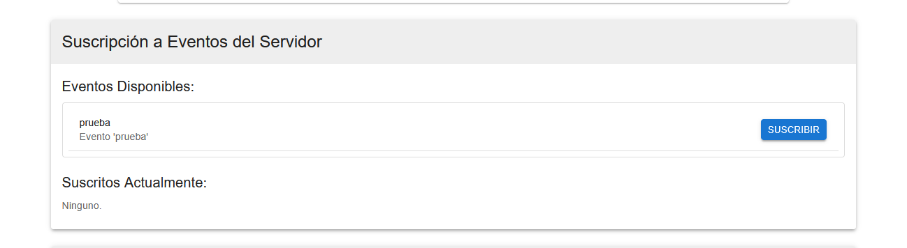

# Proyecto: Cliente de Simulación de Scheduling y Procesamiento de Archivos CSV

Este proyecto presenta una aplicación cliente-servidor con una interfaz gráfica de usuario (GUI) robusta desarrollada en React. La aplicación ofrece dos funcionalidades principales y distintas:

1.  **Simulador de Algoritmos de Scheduling de Procesos (Ejecución Local en GUI):**

    - Permite a los usuarios ingresar datos de múltiples procesos (tiempos de llegada, tiempos de ráfaga, prioridades).
    - Seleccionar entre diversos algoritmos de planificación (FCFS, SJF, SRTF, Round Robin, Prioridad No Expropiativo, Prioridad Expropiativo, HRRN).
    - Ejecutar una simulación puramente local en la GUI para observar el comportamiento de estos algoritmos.
    - Visualizar los resultados mediante un Diagrama de Gantt detallado y una tabla de métricas (Completion Time, Turnaround Time, Waiting Time, y sus promedios) para cada proceso simulado.
    - Esta simulación local tiene como objetivo principal la enseñanza y comprensión de los algoritmos de scheduling. Los parámetros de esta simulación local también se notifican al servidor.

2.  **Cliente para Procesamiento de Archivos .TXT y Generación de CSV (Interacción Cliente-Servidor):**
    - Permite al usuario conectarse a un servidor Python mediante WebSockets.
    - Suscribirse a eventos definidos en el servidor.
    - Configurar el número de "Threads" o "Processes (Forks)" que el **servidor Python** utilizará para el procesamiento de archivos `.txt`. Esta configuración se envía al servidor.
    - Cargar archivos `.txt` locales. Estos archivos se suben a un servidor HTTP auxiliar (Node.js) y sus rutas se ponen a disposición para el procesamiento por el servidor Python.
    - Cuando un evento suscrito es disparado por el servidor Python:
      - El cliente solicita al servidor Python el procesamiento de los archivos `.txt` seleccionados (o un conjunto por defecto si no hay selección).
      - El servidor Python procesa estos archivos (usando regex para extraer datos, y aplicando la configuración de concurrencia recibida).
      - El servidor envía las filas de datos extraídos (filas del CSV) al cliente en tiempo real vía WebSockets.
      - La GUI del cliente muestra estas filas en una tabla y permite al usuario descargar el archivo CSV completo resultante.


## Características Detalladas

- **Interfaz Gráfica Intuitiva (React con Material-UI):** Para una fácil interacción.
- **Simulación de Scheduling Local:**
  - Entrada flexible de datos de procesos.
  - Amplia selección de algoritmos de scheduling.
  - Visualización clara con Diagrama de Gantt dinámico y tabla de métricas.
    
- **Interacción Cliente-Servidor para Procesamiento de Archivos:**
  - Conexión y comunicación por WebSockets con el servidor Python.
  - Gestión de suscripción a eventos del servidor.
  - Configuración de concurrencia (Threads/Forks) para el procesamiento en el **servidor**.
    
  - Carga de archivos `.txt` mediante un servidor HTTP auxiliar.
    
  - Visualización en tiempo real de las filas CSV generadas por el servidor.
    
  - Descarga del archivo CSV completo.

## Estructura del Proyecto

- `cliente/`: Contiene la aplicación cliente desarrollada en React (GUI).
  - `cliente/src/ProcessScheduler.jsx`: Componente principal de la GUI con la lógica de simulación local y comunicación con el servidor.
  - `cliente/src/algorithms/`: Implementaciones JavaScript de los algoritmos de scheduling para la simulación local.
  - `cliente/src/server_http_upload.js`: Servidor auxiliar Node.js/Express para gestionar la subida de archivos `.txt` desde la GUI.
- `servidor/`: Contiene la aplicación servidor desarrollada en Python (NO incluida en este frontend, se ejecuta por separado).
  - `servidor/servidor_websockets.py`: Script del servidor Python principal (requerido).
- `english_text_files/`: Directorio con archivos `.txt` de ejemplo (para ser procesados por el servidor Python).
- `screenshots/`: Carpeta sugerida para guardar las capturas de pantalla de la GUI.

## Prerrequisitos (Windows)

- **Para el Cliente React y el Servidor de Carga de Archivos (Node.js):**
  - Node.js (v14+ LTS recomendado). Puedes descargarlo desde [nodejs.org](https://nodejs.org/en/download/). Incluye npm.
- **Para el Servidor Principal (Python):**
  - Python 3.7+ (asegúrate de que esté añadido al PATH). Descárgalo desde [python.org](https://www.python.org/downloads/windows/).
  - Pip (generalmente se instala con Python).
  - Biblioteca Python: `websockets`.

## Instalación (Windows)

1.  **Descargar los archivos del proyecto Cliente y Servidor en la carpeta del zip.**
    Asegúrate de tener tanto la carpeta `cliente` como la carpeta `servidor` (esta última con `servidor_websockets.py`).

2.  **Abrir Terminales:**
    Necesitarás **tres** instancias de terminal (Command Prompt o PowerShell).

3.  **Crear carpeta de screenshots (sugerido):**
    En la raíz de tu proyecto (donde está la carpeta `cliente` y `servidor`), crea:

    ```cmd
    mkdir screenshots
    ```

4.  **Configurar el Servidor Principal Python:**
    En una terminal, navega a la raíz de tu proyecto. Luego instala las dependencias de Python:

    ```cmd
    pip install websockets
    ```

5.  **Configurar el Cliente React (GUI) y el Servidor de Carga de Archivos:**
    En una segunda terminal, **es crucial que primero navegues al directorio `cliente`**:
    ```cmd
    cd cliente
    ```
    Una vez que tu terminal esté **DENTRO de la carpeta `cliente`**, ejecuta el siguiente comando para instalar las dependencias de Node.js:
    ```cmd
    npm install
    ```
    (También puedes usar la abreviatura `npm i`). Este paso descargará todos los paquetes necesarios para que la interfaz gráfica funcione.

## Ejecución (Windows)

Debes iniciar tres componentes en **terminales separadas**.

1.  **Iniciar el Servidor Principal Python (WebSocket):**
    En la primera terminal, desde la raíz del proyecto:

    ```cmd
    python servidor/servidor_websockets.py
    ```

    (Por defecto, se ejecutará en `ws://localhost:8765`). La terminal del servidor permanecerá activa y mostrará logs. **Es en esta terminal donde se introducen los comandos para gestionar eventos y otras operaciones del servidor.**

2.  **Iniciar el Servidor de Carga de Archivos (Node.js):**
    En la segunda terminal, desde la raíz del proyecto:

    ```cmd
    node cliente/src/server_http_upload.js
    ```

    (Por defecto, se ejecutará en `http://localhost:3001`).

3.  **Iniciar la Aplicación Cliente (React GUI):**
    En la tercera terminal, **primero navega al directorio `cliente`**:
    ```cmd
    cd cliente
    ```
    Una vez **DENTRO de la carpeta `cliente`**, ejecuta:
    ```cmd
    npm start
    ```
    Esto abrirá la interfaz gráfica en tu navegador (usualmente `http://localhost:3000`).

## Uso de la Aplicación

### A. Simulación de Algoritmos de Scheduling (Local en GUI)

1.  **Ingresar Datos de Procesos:** En la sección "Simulación de Planificador (Local)", introduce los tiempos de llegada y ráfaga para cada proceso (separados por espacios). Si el algoritmo es de prioridad, ingresa también las prioridades.
2.  **Seleccionar Algoritmo:** Elige un algoritmo de scheduling (FCFS, SJF, RR, etc.) del menú desplegable. Si es Round Robin, especifica el Quantum.
3.  **Simular:** Haz clic en "Simular Localmente".
4.  **Visualizar Resultados:**
    - Observa el **Diagrama de Gantt** generado para ver la secuencia de ejecución de los procesos.
    - Revisa la **Tabla de Resultados** con las métricas (CT, TAT, WT) para cada proceso y los promedios.
    - Los parámetros de esta simulación local también se envían al servidor Python para su conocimiento.

### B. Interacción con el Servidor Python (Gestión de Eventos y Procesamiento de Archivos .TXT)

Esta sección detalla cómo el administrador del servidor Python (usando la terminal donde se ejecuta `servidor_websockets.py`) y el usuario de la GUI interactúan para la funcionalidad de procesamiento de archivos `.txt`.

#### B.1. Comandos Disponibles en la Terminal del Servidor Python

Una vez que el script `servidor/servidor_websockets.py` está en ejecución, el administrador puede introducir comandos directamente en esa terminal. Para obtener una lista actualizada de todos los comandos y su sintaxis exacta, simplemente escribe `help` y presiona Enter:

- Esto mostrará una salida en la consola del servidor, similar a la siguiente:

- Comandos disponibles:
  - help - Muestra esta lista de comandos.
  - add_event &lt;nombre_evento> &lt;descripcion> - Añade un nuevo evento. La descripción puede tener espacios.
  - remove_event &lt;nombre_evento> - Elimina un evento.
  - trigger_event &lt;nombre_evento> - Dispara un evento para notificar a los clientes suscritos.
  - list_events - Muestra los eventos disponibles y sus descripciones.
  - list_clients - Muestra los clientes conectados.
  - config_threads &lt;modo: thread|process> &lt;numero> - Configura el modo y número de workers para el servidor.
  - exit - Cierra el servidor y notifica a los clientes.


_(Reemplaza con una captura de pantalla real de la salida del comando `help` en tu servidor. Asegúrate que la captura muestre todos los comandos listados arriba de forma clara.)_

**Gestión de Eventos: Añadir, Listar y Disparar**

Los eventos son el mecanismo principal mediante el cual el servidor puede instruir a los clientes suscritos para que inicien ciertas acciones, como el procesamiento de archivos.

- **Añadir un Nuevo Evento (`add_event <nombre_evento> <descripcion>`):**
  Este comando permite al administrador crear nuevos eventos en el sistema. Los clientes podrán ver estos eventos y suscribirse a ellos.

  - **Sintaxis:** `add_event <nombre_del_evento_sin_espacios> <descripcion_del_evento_puede_contener_espacios_y_ser_larga>`
  - **`<nombre_del_evento_sin_espacios>`**: Es un identificador único para el evento. No debe contener espacios para que el servidor pueda parsearlo correctamente. Por ejemplo: `procesamiento_lote_A`, `reporte_diario`, `actualizar_datos_urgente`.
  - **`<descripcion_del_evento_puede_contener_espacios_y_ser_larga>`**: Es una descripción textual del evento. Puede tener múltiples palabras y espacios. Esta descripción se mostrará a los clientes en la GUI para que entiendan el propósito del evento.
  - **Ejemplo Práctico:** Para crear un evento llamado `informe_ventas_mayo` con la descripción "Genera el informe de ventas consolidado para el mes de Mayo":
    ```
    add_event informe_ventas_mayo Genera el informe de ventas consolidado para el mes de Mayo
    ```
    El servidor usualmente confirmará la creación del evento en su log. Este nuevo evento estará inmediatamente disponible:
    - Al ejecutar `list_events` en la terminal del servidor.
    - Para los clientes React conectados (la GUI debería actualizar su lista de eventos disponibles o obtenerla al reconectar/refrescar).

- **Listar Eventos Existentes (`list_events`):**
  Este comando es útil para que el administrador vea todos los eventos que han sido añadidos y están actualmente activos en el servidor.

  - **Sintaxis:** `list_events`
  - **Salida Esperada:** El servidor mostrará en su consola una lista de cada nombre de evento registrado junto con su descripción correspondiente. Por ejemplo:
    ```
    > list_events
    Eventos disponibles:
    - evento_prueba: Descripción de prueba inicial
    - informe_ventas_mayo: Genera el informe de ventas consolidado para el mes de Mayo
    ```

- **Disparar un Evento (`trigger_event <nombre_evento>`):**
  Este es el comando fundamental para iniciar la acción principal de procesamiento de archivos `.txt` en los clientes que se hayan suscrito al evento especificado.
  - **Sintaxis:** `trigger_event <nombre_del_evento_existente>`
    - Es crucial que `<nombre_del_evento_existente>` sea un nombre de evento que ya haya sido añadido con `add_event` y que aparezca en la salida de `list_events`.
  - **Ejemplo Práctico:** Para disparar el evento `informe_ventas_mayo` que creamos anteriormente:
    ```
    trigger_event informe_ventas_mayo
    ```
  - **Funcionamiento Detallado al Disparar un Evento:**
    1.  **Identificación de Suscriptores por el Servidor:** Al ejecutar `trigger_event`, el servidor Python busca en sus registros internos todos los clientes WebSocket que actualmente están conectados Y que previamente se han suscrito (a través de la GUI) al evento `informe_ventas_mayo`.
    2.  **Notificación a Clientes Suscritos:** A cada uno de estos clientes suscritos, el servidor Python envía un mensaje específico a través de la conexión WebSocket. Este mensaje típicamente contendrá información como `{"tipo": "evento_disparado", "evento": "informe_ventas_mayo"}`.
    3.  **Reacción de la GUI del Cliente (React):**
        - Cuando la aplicación cliente React recibe este mensaje de `evento_disparado` del servidor (la lógica para esto está en `ProcessScheduler.jsx`, dentro de la función `handleWsMessage`):
          - Verifica si realmente está suscrito al evento `informe_ventas_mayo`.
          - Si está suscrito, informa al usuario a través de la GUI (ej. un mensaje en la sección "Estado de Conexión" o una notificación).
          - Prepara la interfaz para la visualización de los resultados del procesamiento de archivos (ej. limpia la tabla "Datos CSV Generados por el Servidor" de datos anteriores, podría mostrar un indicador de "Procesando...").
          - **Crucialmente, el cliente React envía automáticamente un nuevo mensaje de vuelta al servidor Python.** Este mensaje es típicamente de tipo `solicitar_procesamiento_csv`. Este mensaje de solicitud es el que efectivamente pide al servidor que comience a trabajar con los archivos. Contiene:
            - `rutas_archivos_subidos`: Un array de strings, donde cada string es la ruta (en el servidor auxiliar de carga) de un archivo `.txt` que el usuario seleccionó previamente en la GUI (ej. `['uploads/datos_clienteA.txt', 'uploads/datos_clienteB.txt']`). Si el usuario no seleccionó archivos específicos, esta lista podría estar vacía, y el servidor Python podría tener una lógica para procesar un conjunto de archivos por defecto o todos los disponibles en una carpeta predefinida.
            - `scheduling_config`: Un objeto JSON que contiene la configuración actual de la sección "Simulación de Planificador (Local)" de la GUI. Esto incluye el algoritmo de scheduling seleccionado (ej. "FCFS", "SJF", etc.), y los strings de los tiempos de llegada, tiempos de ráfaga, prioridades y quantum tal como los ingresó el usuario para la simulación local.
    4.  **Procesamiento de Archivos en el Servidor Python:**
        - Al recibir el mensaje `solicitar_procesamiento_csv` del cliente (o clientes), el servidor Python:
          - Accede y lee el contenido de los archivos `.txt` especificados en `rutas_archivos_subidos`.
          - Aplica las operaciones de expresiones regulares (regex) que tenga definidas para extraer la información deseada de cada archivo.
          - Utiliza la configuración de concurrencia (previamente establecida por el comando `config_threads` del servidor o por un mensaje de configuración del cliente) para gestionar cómo se realiza este procesamiento (ej. si puede usar múltiples hilos o procesos para trabajar en varios archivos o partes de archivos simultáneamente, si está implementado).
          - **Uso de `scheduling_config` (Opcional por el Servidor):** La implementación del servidor Python decidirá si utiliza o no la `scheduling_config` enviada por el cliente. Podría, por ejemplo, si el cliente envió "SJF" y el servidor tiene una forma de estimar el "tamaño" de procesamiento de cada archivo `.txt`, intentar procesar primero los archivos que estime más "cortos". O podría usar los ATs/Prioridades para priorizar el orden de procesamiento de los archivos. Esta es una parte avanzada y depende de la lógica específica de tu `servidor_websockets.py`.
          - A medida que se generan filas de datos (que conformarán el CSV final), el servidor Python envía estas filas, una por una o en pequeños lotes, de vuelta al cliente solicitante mediante mensajes WebSocket (ej. `{"tipo": "csv_actualizacion_fila", "fila_csv": {"columna1": "datoA", "columna2": "datoB"}}`).
          - La GUI del cliente recibe estas `csv_actualizacion_fila` y va poblando la tabla "Datos CSV Generados por el Servidor (Stream)" en tiempo (semi)real.
          - Una vez que el servidor ha terminado de procesar todos los archivos correspondientes a esa solicitud, envía un mensaje de finalización (ej. `{"tipo": "procesamiento_csv_terminado"}`). La GUI del cliente entonces habilitará, por ejemplo, el botón de "Descargar CSV Completo".

#### B.2. Interacción del Usuario en la GUI del Cliente

_(Esta sección se mantiene igual que en tu versión proporcionada, ya que detalla la perspectiva del cliente. Asegúrate que las capturas de pantalla referenciadas sean correctas.)_

1.  **Conexión y Estado del Servidor:** Asegúrate de que la GUI muestre "CONECTADO" al servidor WebSocket.
2.  **Suscripción a Eventos:** En "Suscripción a Eventos del Servidor", la GUI mostrará los eventos disponibles (añadidos desde la terminal del servidor). El usuario hace clic en "Suscribir" para los eventos de interés.
    
    _(Captura mostrando la lista de eventos y botones de suscribir/desuscribir)_
3.  **Configurar Concurrencia del Servidor:** En "Configuración de Concurrencia (para Servidor WebSocket)", selecciona "Threads" o "Processes (Forks)" y el número deseado. Haz clic en "Aplicar Configuración al Servidor".
4.  **Cargar Archivos .TXT:** En "Archivo(s) TXT para Procesamiento en Servidor", haz clic en "Seleccionar Archivo(s) .TXT" y elige los archivos `.txt` que quieres que el servidor procese.
5.  **Recepción del Evento y Procesamiento:** Cuando el administrador dispare un evento (ver B.1) al que el cliente está suscrito, la GUI reaccionará como se describe en el "Funcionamiento Detallado al Disparar un Evento".
6.  **Visualizar Datos CSV del Servidor:** La tabla "Datos CSV Generados por el Servidor (Stream)" comenzará a llenarse con las filas de datos extraídos por el servidor.
7.  **Descargar CSV:** Una vez que el servidor indica "Procesamiento CSV en servidor terminado", puedes hacer clic en "Descargar CSV Completo".

#### B.3. Otros Comandos del Servidor Python (disponibles para el administrador en su terminal)

Utiliza `help` en la terminal del servidor para ver todos los comandos. Algunos otros comandos útiles que tu servidor podría tener (basado en la salida de `help` proporcionada) son:

- `remove_event <nombre_evento>`: Elimina un evento del sistema.
  - **Ejemplo:** `remove_event informe_ventas_mayo`
- `list_clients`: Muestra una lista de los clientes WebSocket que están actualmente conectados al servidor. Esto puede ser útil para depuración o para saber cuántos clientes recibirán un `trigger_event`.
- `config_threads <modo: thread|process> <numero>`: Permite al administrador del servidor configurar directamente el modo de concurrencia (`thread` o `process`) y el número de "workers" (hilos o procesos) que el servidor Python utilizará para el procesamiento de archivos `.txt`.
  - **Ejemplo:** `config_threads thread 4` le indicaría al servidor que intente usar 4 hilos para el procesamiento.
- `exit`: Cierra el servidor Python de forma ordenada, intentando notificar a los clientes conectados para que finalicen sus operaciones.

## Pruebas Sugeridas

- **Simulación Local:**
  - Prueba cada algoritmo de scheduling con diferentes conjuntos de datos de llegada/ráfaga/prioridad. Observa cómo cambian el Gantt y las métricas.
  - Para Round Robin, varía el quantum y observa su impacto.
- **Procesamiento Cliente-Servidor:**
  - **Flujo completo de eventos:**
    1.  Desde la terminal del servidor Python, añade un nuevo evento: `add_event mi_prueba_csv Procesa archivos para prueba`.
    2.  Verifica con `list_events` que el evento fue añadido.
    3.  En la GUI del Cliente, verifica que `mi_prueba_csv` aparezca en la lista de eventos disponibles y suscríbete a él.
    4.  Configura la concurrencia para el servidor desde la GUI (ej. 2 Threads).
    5.  Carga algunos archivos `.txt` en la GUI.
    6.  Desde la terminal del servidor Python, dispara el evento: `trigger_event mi_prueba_csv`.
    7.  Observa en la GUI del Cliente cómo se actualiza el estado, cómo se llena la tabla de CSV y finalmente descarga el archivo CSV resultante.
  - Configura diferentes números de "Threads/Processes" para el servidor y observa si hay cambios en la velocidad percibida de llenado de la tabla CSV (esto dependerá de la implementación del servidor Python y la carga de trabajo).
  - Descarga el CSV y verifica su contenido.
  - Prueba qué sucede si no seleccionas archivos en la GUI y se dispara un evento (el servidor debería procesar un conjunto por defecto, si así está programado).

## Tecnologías Utilizadas

- **Cliente (GUI) y Servidor de Carga Auxiliar**: React, JavaScript, Material-UI, Framer Motion, Node.js, Express, `socket.io-client`, `papaparse`, `multer`.
- **Servidor Principal (requerido, no incluido en esta base de código del cliente)**: Python, `websockets`, `asyncio`.
